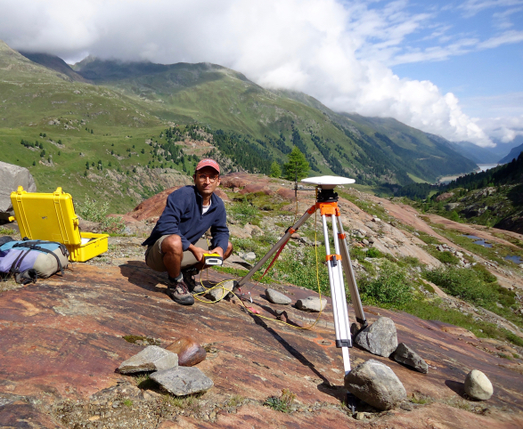
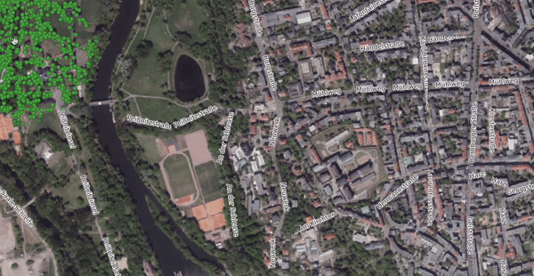
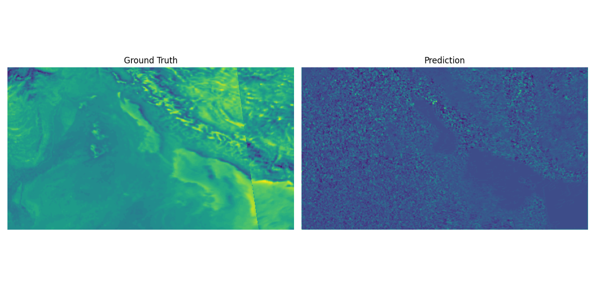

```{=html}
<section class="profile-hero">
  <div class="profile-hero__content">
   <!--  <p class="eyebrow">Earth System Data Science | Computer Vision | Digital Twins</p> -->
    <h1>Taimur Khan</h1>
    <p class="hero-lede">
      I build AI, remote sensing, and high-performance computing systems that help researchers model,
      monitor, and predict environmental change. Currently a data scientist at Helmholtz-UFZ.
    </p>
    <div class="hero-tags" aria-label="Focus areas">
      <span>Computer Vision</span>
      <span>HPC</span>
      <span>Deep Learning</span>
      <span>Web Development</span>
      <span>Remote Sensing</span>
    </div>
    <div class="hero-actions">
      <a class="button button-primary" href="projects.html">View projects</a>
      <a class="button button-secondary" href="mailto:thisistaimur@icloud.com">Get in touch</a>
    </div>
    <nav class="hero-socials" aria-label="Profile links">
      <a href="https://www.linkedin.com/in/taimur-h-khan/" aria-label="LinkedIn">
        <span aria-hidden="true">in</span>
      </a>
      <a href="https://github.com/thisistaimur" aria-label="GitHub">
        <svg aria-hidden="true" viewBox="0 0 24 24" focusable="false">
          <path d="M12 2C6.48 2 2 6.58 2 12.23c0 4.51 2.87 8.34 6.84 9.69.5.09.68-.22.68-.49v-1.89c-2.78.62-3.37-1.22-3.37-1.22-.46-1.19-1.12-1.51-1.12-1.51-.91-.64.07-.63.07-.63 1.01.07 1.54 1.06 1.54 1.06.9 1.57 2.36 1.12 2.94.86.09-.67.35-1.12.64-1.38-2.22-.26-4.56-1.14-4.56-5.06 0-1.12.39-2.03 1.03-2.75-.1-.26-.45-1.3.1-2.71 0 0 .84-.28 2.75 1.05A9.31 9.31 0 0 1 12 6.91c.85 0 1.7.12 2.5.34 1.9-1.33 2.74-1.05 2.74-1.05.55 1.41.2 2.45.1 2.71.64.72 1.03 1.63 1.03 2.75 0 3.93-2.34 4.79-4.57 5.05.36.32.68.94.68 1.9v2.82c0 .27.18.58.69.48A10.04 10.04 0 0 0 22 12.23C22 6.58 17.52 2 12 2Z"/>
        </svg>
      </a>
      <a href="https://orcid.org/0000-0001-7833-5474" aria-label="ORCID">
        <span aria-hidden="true">iD</span>
      </a>
      <a href="https://scholar.google.com/citations?user=5vSbNw0AAAAJ&amp;hl=en&amp;authuser=1" aria-label="Google Scholar">
        <span aria-hidden="true">G</span>
      </a>
    </nav>
  </div>
  <figure class="profile-portrait">
    
  </figure>
</section>
```

## About Me

```{=html}
<section class="earth-scroll" id="about-earth">
  <div class="earth-scroll__stage">
    <div class="earth-scroll__visual" aria-hidden="true">
      <div class="about-globe-panel">
        <canvas id="about-globe" class="about-globe" width="720" height="720"></canvas>
        <div class="globe-status">
          <div class="globe-caption">
            <span>Now showing</span>
            <strong id="globe-focus">Global view</strong>
          </div>
          <div class="scroll-progress" aria-label="About section progress">
            <span id="scroll-progress-count">1 / 6</span>
            <div class="scroll-progress__dots" id="scroll-progress-dots"></div>
          </div>
        </div>
      </div>
    </div>

    <div class="earth-scroll__panels">
      <article class="earth-panel is-active" data-phi="0.35" data-theta="0.28" data-focus="Global view">
        <span>My vision</span>
        <h5>The zeitgeist of environmental intelligence</h5>
        <p>
          For much of human history, continuous Earth monitoring was closer to a scientific dream:
          the hope of observing forests, cities, oceans, and atmosphere change in real time. That
          moment simultaneously arrived just as AI became practical enough to help read the flood of images and
          measurements it produces.
        </p>
        <p>
          The work now is to make this abundance intelligible. I build AI and remote sensing tools
          that help researchers read environmental change carefully, from tree crown segmentation to
          smog forecasting and biodiversity foundation models.
        </p>
      </article>

      <article class="earth-panel" data-phi="-1.9" data-theta="0.2" data-focus="New York / Halle">
        <span>Academic background</span>
        <p>
          Earth System Data Science and Remote Sensing (M.Sc.) at
          <a href="https://www.uni-leipzig.de">University of Leipzig</a>, with Geosciences and Physics
          (B.A.) from <a href="https://www.skidmore.edu">Skidmore College</a>.
        </p>
      </article>

      <article class="earth-panel" data-phi="-0.7" data-theta="0.24" data-focus="Halle, Germany">
        <span>Research</span>
        <p>Unraveling Earth's systems through numerical models, statistical methods, and machine learning. Working as a data scientist at the <a href="https://www.ufz.de/index.php?en=49404">Helmholtz Centre for Environmental Research - UFZ</a> in Germany. See my <a href="publications.html">publications</a> for research papers and open software contributions.</p>
      </article>

      <article class="earth-panel" data-phi="0.82" data-theta="0.2" data-focus="Lahore, Pakistan">
        <span>Startups and Engineering</span>
        <p>Founder and Lead Engineer at <a href="https://www.adsata.com">Adsata</a>, developing an edge-ML platform for webcam-based webcam eyetracking.</p>
      </article>

      <article class="earth-panel" data-phi="-1.65" data-theta="0.18" data-focus="New York, USA">
        <span>Open Source and AI</span>
        <p>Developed several open-source libraries for remote sensing and environmental data analysis, like <a href="https://deeptrees.de">DeepTrees</a>, <a href="https://github.com/Clim-Hub">ClimHub</a>, <a href="https://huggingface.co/spaces/thisistaimur/fskd-mitb2-demo">FSKD</a>, <a href="https://huggingface.co/kernels/thisistaimur/tiledattention">TiledAttention</a>, <a href="https://khant.pages.ufz.de/opendap/intro.html">OPeNDAP Data Catalogue</a>, to name a few.</p>
      </article>

      <article class="earth-panel" data-phi="-0.72" data-theta="0.24" data-focus="Halle, Germany">
        <span>Teaching</span>
        <p>Sharing practical methods through workshops, courses, and collaborative technical mentoring. Some of these can be found on the <a href="courses.html">teaching page</a></p>
      </article>
    </div>
  </div>
</section>

<script type="module">
  import createGlobe from "https://cdn.jsdelivr.net/npm/cobe@2.0.1/+esm";

  const canvas = document.getElementById("about-globe");
  const section = document.getElementById("about-earth");
  const panels = [...document.querySelectorAll(".earth-panel")];
  const focusLabel = document.getElementById("globe-focus");
  const progressCount = document.getElementById("scroll-progress-count");
  const progressDotsContainer = document.getElementById("scroll-progress-dots");
  let progressDots = [];

  if (canvas) {
    const reduceMotion = window.matchMedia("(prefers-reduced-motion: reduce)");
    let width = 0;
    let phi = 0.35;
    let theta = 0.28;
    let targetPhi = phi;
    let targetTheta = theta;
    let globe;
    let frame;
    let activeIndex = 0;

    if (progressDotsContainer) {
      progressDotsContainer.innerHTML = "";
      progressDots = panels.map((panel, index) => {
        const button = document.createElement("button");
        button.type = "button";
        button.setAttribute("aria-label", `Show ${panel.querySelector("span")?.textContent || `item ${index + 1}`}`);
        button.addEventListener("click", () => scrollToPanel(index));
        progressDotsContainer.appendChild(button);
        return button;
      });
    }

    const markers = [
      { location: [31.52, 74.36], size: 0.04 },
      { location: [51.48, 11.97], size: 0.04 },
      { location: [40.71, -74.01], size: 0.04 },
      { location: [-36.85, 174.76], size: 0.04 },
    ];

    const resize = () => {
      width = canvas.offsetWidth;
      canvas.width = width * 2;
      canvas.height = width * 2;
      globe?.update({ width: width * 2, height: width * 2 });
    };

    resize();

    globe = createGlobe(canvas, {
      devicePixelRatio: 2,
      width: width * 2,
      height: width * 2,
      phi,
      theta,
      dark: 0,
      diffuse: 1.25,
      mapSamples: 16000,
      mapBrightness: 5.8,
      baseColor: [0.96, 0.99, 0.96],
      markerColor: [0.76, 0.55, 0.18],
      glowColor: [0.88, 0.96, 0.9],
      markers,
      opacity: 0.96,
      scale: 1.04,
    });

    const setActivePanel = (panel) => {
      panels.forEach((item) => item.classList.toggle("is-active", item === panel));
      const panelIndex = panels.indexOf(panel);
      progressDots.forEach((item, index) => {
        item.classList.toggle("is-active", index === panelIndex);
        item.toggleAttribute("aria-current", index === panelIndex);
      });
      if (progressCount) {
        progressCount.textContent = `${panelIndex + 1} / ${panels.length}`;
      }
      targetPhi = Number(panel.dataset.phi || targetPhi);
      targetTheta = Number(panel.dataset.theta || targetTheta);
      if (focusLabel && panel.dataset.focus) {
        focusLabel.textContent = panel.dataset.focus;
      }
      if (reduceMotion.matches) {
        phi = targetPhi;
        theta = targetTheta;
        globe.update({ phi, theta });
      }
    };

    const scrollToPanel = (index) => {
      if (!section || panels.length < 2) return;

      const scrollable = Math.max(1, section.offsetHeight - window.innerHeight);
      const targetProgress = panels.length === 1 ? 0 : index / (panels.length - 1);
      const rawProgress = 0.06 + targetProgress * 0.88;
      const targetTop = window.scrollY + section.getBoundingClientRect().top + rawProgress * scrollable;

      window.scrollTo({
        top: targetTop,
        behavior: reduceMotion.matches ? "auto" : "smooth",
      });
    };

    const updateFromScroll = () => {
      if (!section || panels.length === 0) return;

      const rect = section.getBoundingClientRect();
      const scrollable = Math.max(1, rect.height - window.innerHeight);
      const rawProgress = Math.min(1, Math.max(0, -rect.top / scrollable));
      const easedProgress = Math.min(1, Math.max(0, (rawProgress - 0.06) / 0.88));
      const index = Math.min(panels.length - 1, Math.floor(easedProgress * panels.length));

      if (index !== activeIndex) {
        activeIndex = index;
        setActivePanel(panels[activeIndex]);
      }
    };

    setActivePanel(panels[0]);
    updateFromScroll();
    window.addEventListener("scroll", updateFromScroll, { passive: true });

    const animate = () => {
      if (!reduceMotion.matches) {
        phi += (targetPhi - phi) * 0.06;
        theta += (targetTheta - theta) * 0.06;
        globe.update({ phi, theta });
      }
      frame = requestAnimationFrame(animate);
    };

    animate();
    window.addEventListener("resize", resize);
    window.addEventListener("pagehide", () => {
      cancelAnimationFrame(frame);
      window.removeEventListener("scroll", updateFromScroll);
      globe.destroy();
    }, { once: true });
  }
</script>
```

## Glimpses Into My Work

```{=html}
<section class="work-grid">
  <article class="work-card">
    
    <div>
      <h3>Tree Crown Segmentation</h3>
      <p>Segmenting individual tree crowns in multispectral imagery using deep learning.</p>
    </div>
  </article>
  <article class="work-card">
    
    <div>
      <h3>Smog Event Forecasting</h3>
      <p>Forecasting smog events with spatiotemporal deep learning and satellite-derived aerosol data.</p>
    </div>
  </article>
  <article class="work-card">
    
    <div>
      <h3>Secure Webcam Eye Tracking</h3>
      <p>Using edge machine learning to estimate attention and engagement in digital content.</p>
    </div>
  </article>
  <article class="work-card">
    
    <div>
      <h3>Tree Dynamics Simulation</h3>
      <p>Simulating tree dynamics with visual, interactive models built in Processing.</p>
    </div>
  </article>
</section>
```

## In The News

```{=html}
<ul class="news-list">
  <li>
    <a href="https://issuu.com/aspekt-magazin/docs/aspekt_09_2021_es/s/13541949">Die "Blickfänger" von der Saale</a>
    <span>Aspekt Magazin, 15.09.2021</span>
  </li>
  <li>
    <a href="https://www.mz.de/lokal/halle-saale/eyetracking-fur-bessere-datenanalyse-hallesches-startup-in-den-startlochern-1708417">Eyetracking für bessere Datenanalyse: Hallesches Startup in den Startlöchern</a>
    <span>Mitteldeutsche Zeitung, 19.08.2021</span>
  </li>
  <li>
    <a href="https://startup-mitteldeutschland.de/adsata-eyetracking-per-webcam/">Eyetracking per Webcam: Adsata hat Erfolg im Blick</a>
    <span>Startup-Mitteldeutschland, 16.02.2021</span>
  </li>
  <li>
    <a href="https://www.investieren-in-sachsen-anhalt.de/report-invest/schau-mir-in-die-augen">Schau mir in die Augen</a>
    <span>Investitions- und Marketinggesellschaft Sachsen-Anhalt, 28.07.2021</span>
  </li>
</ul>
```

## Let's Collaborate

```{=html}
<section class="collab-panel">
  <p>
    Open to collaborations at the intersection of earth systems, physics, and technology.
    Send a note if you want to discuss research software, AI systems, remote sensing, or digital twins.
  </p>
  <a class="button button-primary" href="mailto:thisistaimur@icloud.com">Start a conversation</a>
</section>
```
